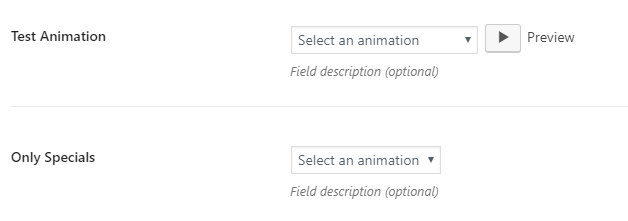

# CMB2 custom field "animation"

Custom field for [CMB2](https://github.com/WebDevStudios/CMB2) to store [Animate.css](https://github.com/daneden/animate.css) animations.



```php
add_action( 'cmb2_admin_init', 'cmb2_animation_metabox' );
function cmb2_animation_metabox() {

	$prefix = 'your_prefix_demo_';

	$cmb_demo = new_cmb2_box( array(
		'id'            => $prefix . 'metabox',
		'title'         => __( 'Test Metabox', 'cmb2' ),
		'object_types'  => array( 'page', 'post' ), // Post type
	) );

	$cmb_demo->add_field( array(
		'name'          => __( 'Test Animation', 'cmb2' ),
		'desc'          => __( 'Field description (optional)', 'cmb2' ),
		'id'            => $prefix . '_animation',
		'type'          => 'animation',
		// 'groups'        => array( 'entrances', 'exits' ), // By default all groups are enabled
		'preview'       => true // "Preview" text where animations are applied on click the play button
		'custom_groups' => array( 
            // Format: '{group}' => '{group_label}'
            'custom_group' => __( 'Custom Group', 'cmb2' ),
        ),
		'custom_animations' => array( 
		    // Format: '{group}' => array( '{animation}' => '{animation_label}' )
            'entrances' => array(
                'custom_entrance' => __( 'Custom Entrance', 'cmb2' ),
            ), 
            'custom_group'  => array(
                'custom_animation' => __( 'Custom Animation on a custom group', 'cmb2' ),
            ) 
		),
	) );

}
```

## Available groups

* seekers


* entrances // Shortcut to enable all entrances (includes flippers, lightspeed and specials entrances)
* bouncing_entrances
* fading_entrances
* rotating_entrances
* sliding_entrances
* zoom_entrances


* exits // Shortcut to enable all exits (includes flippers, lightspeed and specials exists)
* bouncing_exits
* fading_exits
* rotating_exits
* sliding_exits
* zoom_exits


* flippers
* lightspeed
* specials

Examples:
```php
'groups'        => array( 'seekers' )                   // Enable seekers
'groups'        => array( 'entrances' )                 // Enable all entrances
'groups'        => array( 'fading_exits', 'specials' )  // Enable fading exits and specials
```

## Changelog

### 1.0.2
* New animation: jackInTheBox
* Updated animate.css lib to 3.7.0
* Make use of a minified version of animate.css
* Added the ability to pass custom animations
* Improved entrances and exists groups
* Improved animation adding an play button and a preview element

### 1.0.1
* Switched preview to button to allow animate again

### 1.0.0
* Initial commit